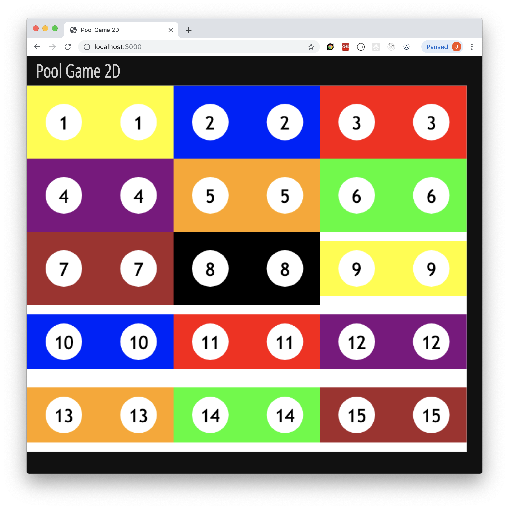
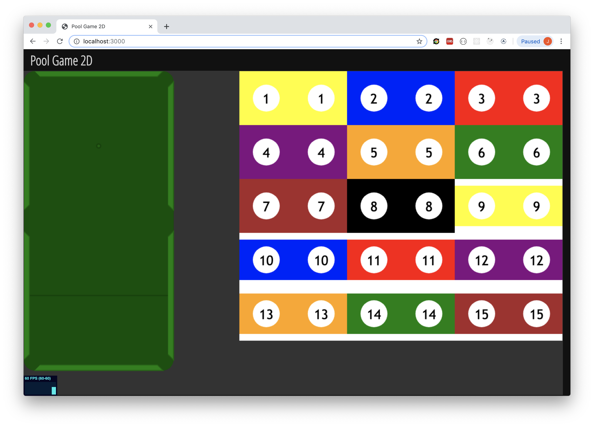
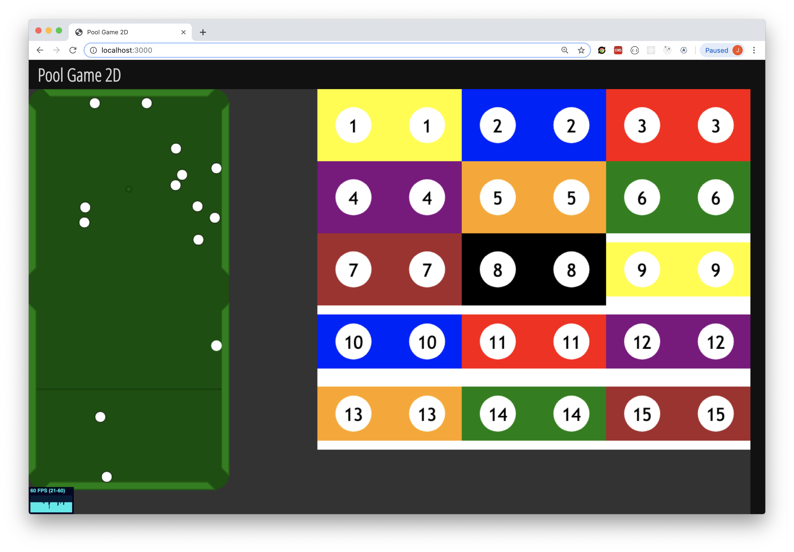
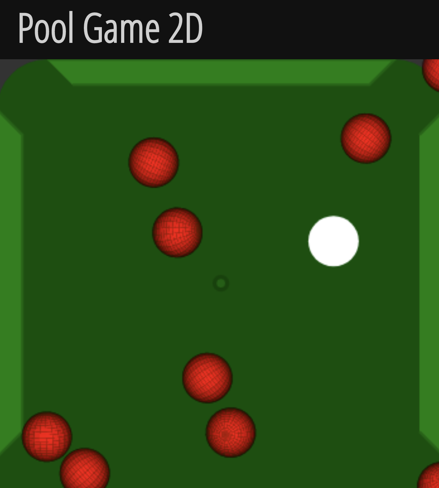
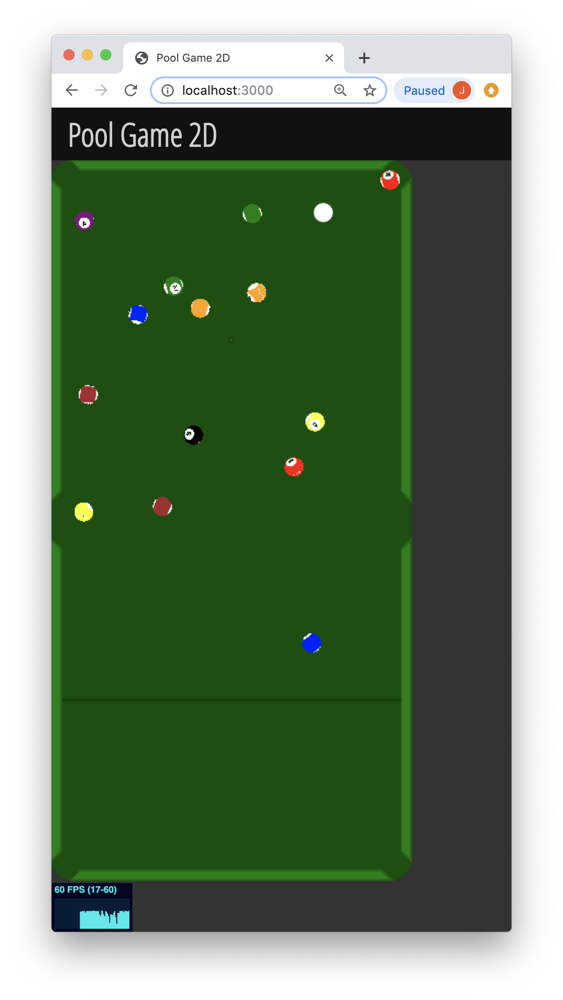
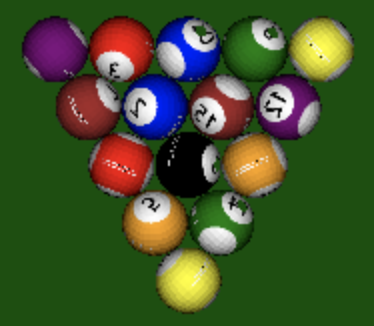

# pool-game-2d
Implementation of the classic [8-ball][eight-ball] pool game for the HTML5 canvas.

- Using TypeScript, SASS with Parcel Bundler
- Using [Matter.js][matter-js] to handle the physics

# Running the program
First, install [Parcel][parcel-bundler] bundler:

<code>sudo npm i -g parcel-bundler</code>

then run `npm start` which will open your browser at http://localhost:3000.

You will probably need the latest version of Node (12.6.0) to make TypeScript work with Parcel Bundler 1.4.1, [read more][issue-1]

# Implementation details

## Ball textures and pool table
The ball textures for balls 1-15 are generated programmatically.
<!--
<figure class="image">
  
  <figcaption>Ball textures</figcaption>
</figure>
-->
The pool table is also programmatically generated and composed by a green table surface with 4-sided polygon segments for the table edges. There are also openings for the 6 holes and indicators for the ball rack position (foot spot) and the cue-ball line.
<!--
<figure class="image">
  
  <figcaption>Generated pool table and balls</figcaption>
</figure>
-->
<figure class="image">
  
  <figcaption>Generated pool table and balls</figcaption>
</figure>

The balls are positioned in the triangular ball rack according to the [general rules][eight-ball-rack] for eight-ball.

## Spheres
The balls are internally represented by spheres, each having their own object coordinate system. These are transformed each animation frame bassed on the motion derived from the physics engine which allows to create realistic rolling on the table and texturing.
<figure class="image">
  
  <figcaption>Flat-shaded spheres</figcaption>
</figure>

## Texturing
<figure class="image">
  
  <figcaption>Textured balls</figcaption>
</figure>

## Shading
<figure class="image">
  
  <figcaption>Shaded balls</figcaption>
</figure>

[eight-ball]: https://en.wikipedia.org/wiki/Eight-ball
[eight-ball-rack]: https://www.wikihow.com/Rack-in-8-Ball
[bilinear-interp]: https://en.wikipedia.org/wiki/Bilinear_interpolation
[barycentric]: https://en.wikipedia.org/wiki/Barycentric_coordinate_system
[uv-mapping]: https://en.wikipedia.org/wiki/UV_mapping
[parcel-bundler]: https://parceljs.org/
[issue-1]: https://github.com/parcel-bundler/parcel/issues/579
[matter-js]: https://ghub.io/matter-js
[poly-decomp]: https://ghub.io/poly-decomp
[stats-js]: https://ghub.io/stats.js
[ball-textures]: https://sites.google.com/site/actividades8/texturas
[shuffle-algorithm]: https://en.wikipedia.org/wiki/Fisher%E2%80%93Yates_shuffle
[texture-mapping-canvas]: https://stackoverflow.com/questions/4774172/image-manipulation-and-texture-mapping-using-html5-canvas
